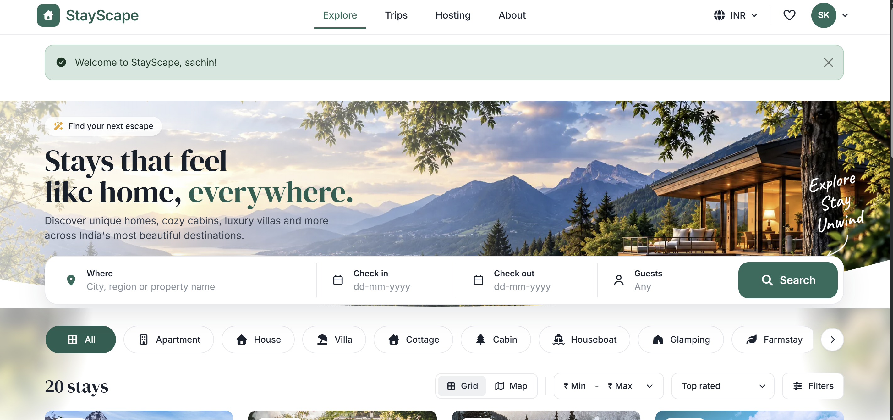
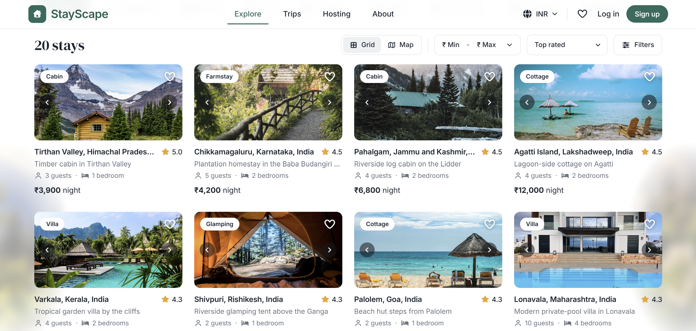
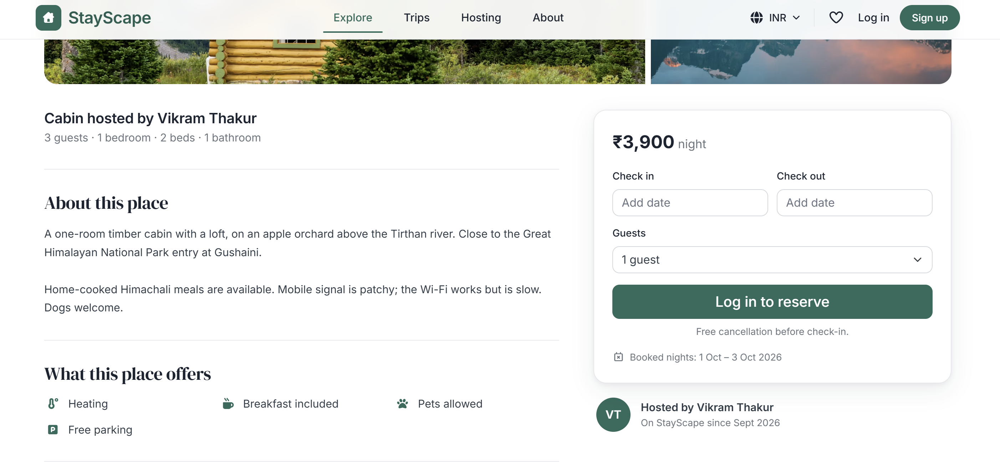
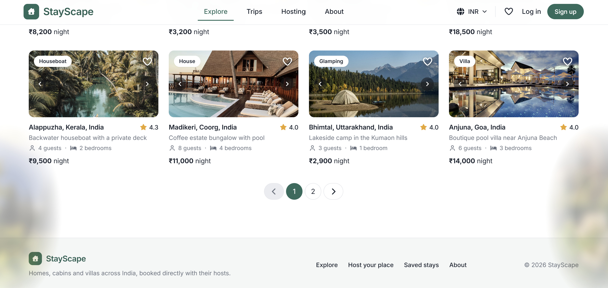

# StayScape

A full-stack accommodation booking platform where guests discover stays, check availability, make reservations, manage trips and save properties, while hosts create listings and manage reservations from a dedicated dashboard.

Built with **MongoDB, Express, React and Node.js (MERN)**.

## Product Preview

<table>
  <tr>
    <td width="50%"></td>
    <td width="50%"></td>
  </tr>
  <tr>
    <td width="50%"></td>
    <td width="50%"></td>
  </tr>
</table>

---

## What StayScape Does

StayScape focuses on the application logic behind real accommodation booking rather than simple listing CRUD.

### Guests

- Search by destination, dates and number of guests
- Filter by property type, price, bedrooms and amenities
- Sort, paginate and switch between grid and map views
- Save stays to a wishlist
- Check availability before booking
- See a live booking price breakdown
- Manage upcoming, completed and cancelled trips
- Review eligible stays

### Hosts

- Create and edit property listings
- Upload and manage up to five photos
- Configure pricing, capacity, amenities and property type
- View reservations and booking activity
- Track completed stays and earnings
- Pause listings
- Cancel upcoming reservations
- Archive listings with booking history

---

## What Makes StayScape Technically Interesting

### Availability and double-booking protection

A booking is checked against existing reservations before insertion and verified again after insertion. Booking rules are enforced on the server rather than relying on client-side state.

### Price snapshots

Each booking stores the price used at reservation time, so later listing changes do not alter an existing reservation.

### Listing lifecycle

Listings with booking history are archived instead of permanently deleted, preserving historical reservations and trip records.

### Server as the source of truth

React handles fast client feedback, while the API re-validates dates, pricing, ownership and booking rules.

### Security by default

Authentication, MongoDB-backed sessions, CSRF protection, Helmet headers, Content Security Policy, rate limiting, Joi validation and secure production cookies are built into the application.

### Maintainable architecture

The frontend is component-based and code-split by route. The backend separates routes, controllers, services, middleware, validators and models.

---

## Core Booking Flow

```text
Search
  |
  v
Filter + Availability Check
  |
  v
Listing Details
  |
  v
Select Dates + Guests
  |
  v
Server-side Validation
  |
  v
Price Snapshot
  |
  v
Booking Created
  |
  v
Guest + Host Dashboards
```

---

## Architecture

```text
                         StayScape
                             |
              +--------------+--------------+
              |                             |
        React Frontend                Express API
              |                             |
       Pages / Components            Middleware Layer
              |                             |
      Context / Hooks / API          Auth / CSRF / Joi
              |                             |
              +-------------+---------------+
                            |
                       Controllers
                            |
                         Services
                            |
                         Mongoose
                            |
                         MongoDB
```

The application follows a layered architecture. The React client handles presentation and interaction, while Express exposes the API and middleware layer. Controllers handle HTTP concerns, services contain business logic, and Mongoose manages persistence.

---

## API Surface

| Method | Endpoint | Purpose |
|---|---|---|
| GET | `/api/session` | Session and application state |
| POST | `/api/auth/signup` | Create account |
| POST | `/api/auth/login` | Authenticate user |
| GET | `/api/listings` | Search, filter and paginate |
| POST | `/api/listings` | Create listing |
| POST | `/api/listings/:id/bookings` | Create booking |
| GET | `/api/trips` | Guest trips |
| GET | `/api/host` | Host dashboard |
| POST | `/api/wishlist/:id` | Toggle wishlist |
| POST | `/api/listings/:id/reviews` | Add review |

---

## Database Design

```text
User
 |
 +----< Listing
 |
 +----< Booking >---- Listing
 |
 +----< Review >----- Booking
```

- **User:** account identity, password credentials and wishlist references
- **Listing:** host, location, pricing, capacity, amenities, images, status and ratings
- **Booking:** guest, host, listing, dates, guest count, price snapshot and status
- **Review:** listing, author and booking with one review per stay

---

## Tech Stack

| Layer | Technology |
|---|---|
| Frontend | React 19, React Router, Vite |
| UI | Bootstrap 5, Font Awesome, Component-level CSS |
| Backend | Node.js 20+, Express 5 |
| Database | MongoDB, Mongoose 9 |
| Authentication | Passport, express-session, connect-mongo |
| Validation | Joi |
| File Uploads | Multer, Cloudinary / local storage |
| Maps | Leaflet, OpenStreetMap |
| Geocoding | Nominatim |
| Dates | flatpickr |
| Testing | Node test runner, Supertest |
| Code Quality | ESLint |

---

## Getting Started

### Requirements

- Node.js 20+
- MongoDB 6+ or MongoDB Atlas

### Installation

```bash
git clone <your-repository-url>
cd StayScape
npm install
```

Copy:

```text
backend/.env.example
```

to:

```text
backend/.env
```

and configure the required environment variables.

### Development

```bash
npm run dev
```

Frontend:

```text
http://localhost:5173
```

API:

```text
http://localhost:8080
```

### Production

```bash
npm run build
npm start
```

Express serves the production React build.

---

## Demo

The seed script creates local demo accounts for testing guest and host flows.

Demo credentials are intended for local and portfolio demonstration only.

---

## Scripts

| Command | Purpose |
|---|---|
| `npm run dev` | Start API and React development servers |
| `npm run build` | Build the React frontend |
| `npm start` | Start the production server |
| `npm run seed` | Seed demo data |
| `npm run lint` | Run ESLint |
| `npm test` | Run unit and integration tests |
| `npm run check` | Run lint, tests and build |

---

## Future Improvements

- Online payment integration
- Guest-host messaging
- Live exchange-rate integration
- Production deployment with managed MongoDB and cloud object storage

---

## Project Scope

StayScape currently focuses on accommodation discovery, booking and host management.

Not included at this stage:

- Online payment processing
- Guest-host messaging
- Live currency exchange rates

Bookings are recorded in INR and payment is handled directly with the host.

---

## Project Structure

```text
StayScape/
├── backend/
│   ├── scripts/
│   ├── src/
│   │   ├── config/
│   │   ├── controllers/
│   │   ├── middleware/
│   │   ├── models/
│   │   ├── routes/
│   │   ├── services/
│   │   ├── utils/
│   │   └── validators/
│   ├── tests/
│   ├── public/
│   │   └── uploads/
│   └── server.js
│
├── frontend/
│   ├── public/
│   ├── src/
│   │   ├── components/
│   │   ├── context/
│   │   ├── hooks/
│   │   ├── lib/
│   │   ├── pages/
│   │   └── styles/
│   ├── index.html
│   └── vite.config.mjs
│
├── docs/
│   ├── architecture.png
│   └── screenshots/
│       ├── explore.png
│       ├── listings.png
│       ├── listing-detail.png
│       └── explore-footer.png
│
├── .gitignore
├── eslint.config.js
├── package.json
├── package-lock.json
└── README.md
```

---

## Why This Project

StayScape goes beyond a basic accommodation CRUD application by solving real booking-domain problems such as availability, double-booking prevention, reservation ownership, price consistency, cancellation rules, review eligibility and listing lifecycle management.

The project is structured as a React frontend backed by a modular Express API and MongoDB.

---

## License

This project is intended for learning, portfolio and demonstration purposes.
